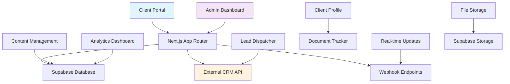
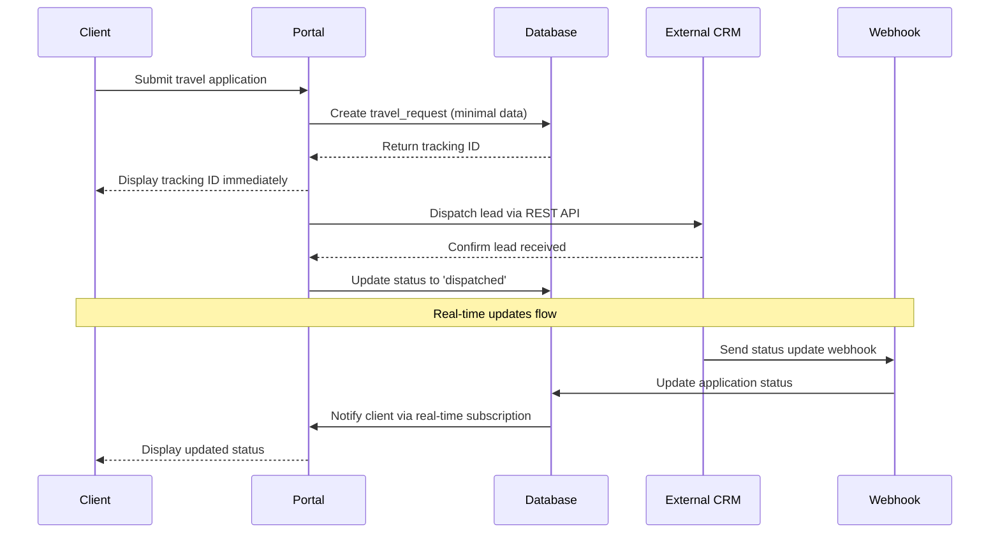
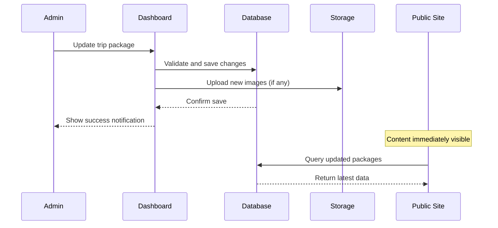

# Design Document: Travel Platform Admin Dashboard & Client Portal

## Overview

This comprehensive design outlines a dual-interface travel platform system consisting of a Site Admin Dashboard (lightweight CMS and monitoring tool) and a Client Portal (application tracking and profile management). The architecture emphasizes zero-blocking user experiences, real-time synchronization with external CRM systems, and seamless integration with the existing Supabase database schema. The system is built on Next.js 16 with TypeScript, shadcn/ui components, and Tailwind CSS v4, ensuring modern development practices and consistent visual branding across both admin and client interfaces.

## Architecture



## Sequence Diagrams

### Client Application Submission Flow



### Admin Content Management Flow



## Components and Interfaces

### Component 1: AdminDashboard

**Purpose**: Main administrative interface for content management, lead monitoring, and analytics

**Interface**:
```typescript
interface AdminDashboardProps {
  user: AdminUser;
  permissions: AdminPermission[];
}

interface AdminDashboard {
  // Content Management
  updateTripPackage(packageId: string, data: TripPackageData): Promise<void>;
  createBanner(banner: BannerData): Promise<string>;
  updateVisaRequirements(country: string, requirements: VisaRequirement[]): Promise<void>;
  
  // Lead Management
  getLeadStatistics(): Promise<LeadStatistics>;
  dispatchLeadToCRM(lead: LeadData): Promise<CRMResponse>;
  
  // Analytics
  getWebsiteAnalytics(): Promise<AnalyticsData>;
  getBookingMetrics(): Promise<BookingMetrics>;
}
```

**Responsibilities**:
- Content creation, editing, and publishing for public site
- Real-time lead capture and immediate CRM dispatch
- High-level analytics dashboard with key metrics
- User permission management and access control

### Component 2: ClientPortal

**Purpose**: Customer-facing application tracking and profile management interface

**Interface**:
```typescript
interface ClientPortalProps {
  user: ClientUser;
  trackingId?: string;
}

interface ClientPortal {
  // Profile Management
  updateProfile(profileData: ClientProfile): Promise<void>;
  uploadDocument(file: File, documentType: DocumentType): Promise<DocumentUpload>;
  
  // Application Tracking
  getApplicationStatus(trackingId: string): Promise<ApplicationStatus>;
  getDocumentChecklist(applicationId: string): Promise<DocumentChecklist>;
  
  // Communication
  getStatusUpdates(): Promise<StatusUpdate[]>;
  subscribeToUpdates(callback: (update: StatusUpdate) => void): () => void;
}
```

**Responsibilities**:
- Zero-blocking application submission with immediate tracking ID generation
- Real-time application status tracking with step-by-step progress
- Document upload and validation with visual feedback
- Real-time webhook integration for status updates

### Component 3: WebhookReceiver

**Purpose**: Secure API endpoints for receiving real-time updates from external CRM

**Interface**:
```typescript
interface WebhookReceiver {
  validateWebhookSignature(payload: string, signature: string): boolean;
  processStatusUpdate(update: CRMStatusUpdate): Promise<void>;
  processDocumentApproval(approval: DocumentApproval): Promise<void>;
  processPaymentUpdate(payment: PaymentUpdate): Promise<void>;
}

interface CRMStatusUpdate {
  trackingId: string;
  status: ApplicationStatus;
  message: string;
  timestamp: string;
  staffId?: string;
}
```

**Responsibilities**:
- Secure webhook validation using HMAC signatures
- Real-time status update processing from external CRM
- Database synchronization with client portal data
- Error handling and retry logic for failed updates

## Data Models

### Model 1: TripPackage

```typescript
interface TripPackage {
  id: string;
  title: string;
  description: string;
  destination: string;
  price: number;
  currency: string;
  duration: number; // days
  images: string[];
  features: string[];
  isActive: boolean;
  createdAt: Date;
  updatedAt: Date;
  createdBy: string; // admin user ID
}
```

**Validation Rules**:
- Title must be 5-100 characters
- Price must be positive number
- At least one image required for active packages
- Destination must be from predefined country list

### Model 2: TravelRequest (Extended from existing schema)

```typescript
interface TravelRequest {
  id: string;
  clientUserId: string;
  destinationCountry: string;
  travelType: 'visa_only' | 'visa_flight' | 'visa_hotel' | 'full_package';
  departureDate?: Date;
  returnDate?: Date;
  travelerCount: number;
  
  // Status tracking
  status: 'pending_documents' | 'documents_review' | 'docs_approved' | 'in_progress' | 'completed' | 'cancelled';
  documentChecklist: DocumentChecklistItem[];
  documentsCompletionPercent: number;
  
  // Communication
  customerNotes?: string;
  staffNotes?: string;
  nextActionRequired?: string;
  nextFollowUpDate?: Date;
  
  // Integration
  linkedVisaApplicationId?: string;
  linkedPaymentId?: string;
  assignedStaffId?: string;
  
  createdAt: Date;
  updatedAt: Date;
  completedAt?: Date;
}

interface DocumentChecklistItem {
  type: string;
  required: boolean;
  status: 'pending' | 'uploaded' | 'under_review' | 'approved' | 'rejected';
  uploadedAt?: Date;
  rejectionReason?: string;
}
```

**Validation Rules**:
- Departure date must be in the future (if provided)
- Return date must be after departure date (if both provided)
- Traveler count must be 1-20
- Document completion percentage auto-calculated from checklist

### Model 3: ContentBanner

```typescript
interface ContentBanner {
  id: string;
  title: string;
  subtitle?: string;
  imageUrl: string;
  linkUrl?: string;
  position: 'hero' | 'secondary' | 'footer';
  displayOrder: number;
  isActive: boolean;
  startDate?: Date;
  endDate?: Date;
  createdAt: Date;
  updatedAt: Date;
  createdBy: string;
}
```

**Validation Rules**:
- Title required, max 200 characters
- Image URL must be valid and accessible
- Start date must be before end date (if both provided)
- Display order must be unique per position

## Algorithmic Pseudocode

### Main Processing Algorithm

```typescript
ALGORITHM processClientApplication(applicationData)
INPUT: applicationData of type ApplicationSubmission
OUTPUT: result of type ApplicationResult

BEGIN
  ASSERT validateApplicationData(applicationData) = true
  
  // Step 1: Create immediate tracking record (zero-blocking)
  trackingId ← generateTrackingId()
  travelRequest ← createTravelRequest({
    ...applicationData,
    status: 'pending_documents',
    trackingId: trackingId,
    createdAt: now()
  })
  
  // Step 2: Return tracking ID immediately to client
  immediateResponse ← {
    trackingId: trackingId,
    message: "Application received successfully",
    nextSteps: generateDocumentChecklist(applicationData.destinationCountry, applicationData.travelType)
  }
  
  // Step 3: Async dispatch to CRM (non-blocking)
  SPAWN_ASYNC dispatchToCRM(travelRequest)
  
  // Step 4: Setup real-time tracking
  setupWebhookEndpoint(trackingId)
  
  ASSERT result.trackingId IS NOT NULL
  RETURN immediateResponse
END
```

**Preconditions:**
- applicationData is validated and well-formed
- Database connection is available
- External CRM API credentials are configured

**Postconditions:**
- Travel request is created in database
- Tracking ID is generated and returned immediately
- CRM dispatch is initiated asynchronously
- Real-time webhook endpoint is configured

**Loop Invariants:** N/A (no loops in main algorithm)

### CRM Dispatch Algorithm

```typescript
ALGORITHM dispatchToCRM(travelRequest)
INPUT: travelRequest of type TravelRequest
OUTPUT: success of type boolean

BEGIN
  maxRetries ← 3
  retryCount ← 0
  
  // Retry loop with exponential backoff
  WHILE retryCount < maxRetries DO
    ASSERT retryCount >= 0 AND retryCount < maxRetries
    
    TRY
      crmPayload ← transformToLeadData(travelRequest)
      response ← crmApi.createLead(crmPayload)
      
      IF response.success THEN
        updateTravelRequest(travelRequest.id, {
          status: 'dispatched_to_crm',
          crmLeadId: response.leadId,
          dispatchedAt: now()
        })
        RETURN true
      END IF
      
    CATCH ApiException AS e
      LOG_ERROR("CRM dispatch failed", e)
      retryCount ← retryCount + 1
      
      IF retryCount < maxRetries THEN
        SLEEP(2^retryCount * 1000) // exponential backoff
      END IF
    END TRY
  END WHILE
  
  // All retries failed
  updateTravelRequest(travelRequest.id, {
    status: 'dispatch_failed',
    errorMessage: "Failed to dispatch to CRM after " + maxRetries + " attempts"
  })
  
  RETURN false
END
```

**Preconditions:**
- travelRequest is a valid TravelRequest object
- CRM API is configured and accessible
- Database update functions are available

**Postconditions:**
- Either successfully dispatched to CRM or marked as failed
- Travel request status is updated in database
- All retry attempts are logged for debugging

**Loop Invariants:**
- retryCount is always within valid range [0, maxRetries)
- Each retry attempt is logged and tracked
- Exponential backoff ensures proper spacing between retries

### Document Status Update Algorithm

```typescript
ALGORITHM updateDocumentStatus(webhookPayload)
INPUT: webhookPayload of type CRMWebhookPayload
OUTPUT: updateResult of type WebhookProcessResult

BEGIN
  // Step 1: Validate webhook signature
  IF NOT validateWebhookSignature(webhookPayload.signature) THEN
    RETURN {success: false, error: "Invalid webhook signature"}
  END IF
  
  // Step 2: Extract update data
  trackingId ← webhookPayload.trackingId
  newStatus ← webhookPayload.status
  documentUpdates ← webhookPayload.documentUpdates
  
  // Step 3: Update database with transaction safety
  BEGIN_TRANSACTION
    
    travelRequest ← getTravelRequestByTrackingId(trackingId)
    IF travelRequest IS NULL THEN
      ROLLBACK_TRANSACTION
      RETURN {success: false, error: "Travel request not found"}
    END IF
    
    // Update main status
    updateTravelRequest(travelRequest.id, {
      status: newStatus,
      updatedAt: now(),
      lastCrmUpdate: now()
    })
    
    // Update individual document statuses
    FOR each docUpdate IN documentUpdates DO
      updateDocumentStatus(travelRequest.id, docUpdate.type, docUpdate.status)
    END FOR
    
    // Recalculate completion percentage
    completionPercent ← calculateDocumentCompletion(travelRequest.id)
    updateTravelRequest(travelRequest.id, {
      documentsCompletionPercent: completionPercent
    })
    
  COMMIT_TRANSACTION
  
  // Step 4: Notify client via real-time channel
  broadcastToClient(travelRequest.clientUserId, {
    type: 'status_update',
    trackingId: trackingId,
    newStatus: newStatus,
    completionPercent: completionPercent,
    timestamp: now()
  })
  
  RETURN {success: true, updatedFields: documentUpdates.length + 1}
END
```

**Preconditions:**
- webhookPayload contains valid signature and data
- Database transaction support is available
- Real-time broadcasting system is configured

**Postconditions:**
- Database is updated consistently or rolled back on error
- Client receives real-time notification of status change
- Document completion percentage is recalculated accurately

**Loop Invariants:**
- All document updates are processed within the same transaction
- Each document update is validated before applying
- Transaction state remains consistent throughout iteration

## Key Functions with Formal Specifications

### Function 1: validateApplicationData()

```typescript
function validateApplicationData(data: ApplicationSubmission): boolean
```

**Preconditions:**
- `data` is non-null and defined
- `data.destinationCountry` is provided
- `data.travelType` is provided

**Postconditions:**
- Returns `true` if and only if all validation rules pass
- Returns `false` if any validation rule fails
- No mutations to input data parameter

**Loop Invariants:** N/A (validation uses conditional checks, not loops)

### Function 2: generateTrackingId()

```typescript
function generateTrackingId(): string
```

**Preconditions:**
- System has access to secure random number generation
- Database connection is available for uniqueness check

**Postconditions:**
- Returns a unique 12-character alphanumeric tracking ID
- Tracking ID format: "TRK" + 9 random characters (e.g., "TRKAB1C2D3E4F")
- Generated ID is guaranteed unique in the database

**Loop Invariants:**
- For uniqueness verification loop: Each iteration checks one potential ID
- Loop continues until unique ID is found or max attempts reached

### Function 3: calculateDocumentCompletion()

```typescript
function calculateDocumentCompletion(travelRequestId: string): number
```

**Preconditions:**
- `travelRequestId` is a valid UUID
- Travel request exists in database
- Document checklist is properly initialized

**Postconditions:**
- Returns integer percentage between 0 and 100
- Calculation based on (approved + uploaded documents) / total required documents
- Zero required documents returns 100% completion

**Loop Invariants:**
- For document counting loop: Running totals remain accurate
- All processed documents have valid status values

## Example Usage

### Example 1: Client Application Submission

```typescript
// Client Portal - Submit new travel application
const applicationData = {
  destinationCountry: 'egypt',
  travelType: 'visa_flight',
  departureDate: new Date('2024-06-15'),
  travelerCount: 2,
  customerNotes: 'Honeymoon trip, prefer direct flights'
};

const result = await processClientApplication(applicationData);

// Immediate response to client
console.log(`Your application has been submitted successfully!`);
console.log(`Tracking ID: ${result.trackingId}`);
console.log(`Next steps: ${result.nextSteps.join(', ')}`);
```

### Example 2: Admin Content Management

```typescript
// Admin Dashboard - Update trip package
const packageUpdate = {
  title: 'Luxor Temple & Nile Cruise Experience',
  price: 1299,
  features: ['5-star accommodation', 'All meals included', 'Expert guide'],
  images: ['/images/luxor-temple.jpg', '/images/nile-cruise.jpg'],
  isActive: true
};

await adminDashboard.updateTripPackage('pkg_123', packageUpdate);

// Content immediately visible on public site
console.log('Package updated successfully and published');
```

### Example 3: Real-time Webhook Processing

```typescript
// Webhook endpoint - Process CRM status update
const webhookPayload = {
  trackingId: 'TRKAB1C2D3E4F',
  status: 'docs_approved',
  documentUpdates: [
    { type: 'passport', status: 'approved' },
    { type: 'photo', status: 'approved' }
  ],
  message: 'All documents approved, visa processing started',
  timestamp: new Date().toISOString(),
  signature: 'hmac-sha256=...'
};

const result = await updateDocumentStatus(webhookPayload);

if (result.success) {
  // Client immediately sees updated status in their portal
  console.log(`Updated ${result.updatedFields} fields for client`);
}
```

### Example 4: Complete Workflow Example

```typescript
// Complete flow: Application → CRM → Webhook → Client Update
async function demonstrateCompleteWorkflow() {
  // 1. Client submits application
  const application = await processClientApplication({
    destinationCountry: 'uae',
    travelType: 'visa_only',
    travelerCount: 1
  });
  
  console.log(`Application submitted: ${application.trackingId}`);
  
  // 2. CRM processes and sends update (simulated)
  setTimeout(async () => {
    await updateDocumentStatus({
      trackingId: application.trackingId,
      status: 'documents_review',
      message: 'Staff reviewing submitted documents',
      signature: 'valid-hmac-signature'
    });
    
    console.log('Status updated: Documents under review');
  }, 5000);
  
  // 3. Final approval (simulated)
  setTimeout(async () => {
    await updateDocumentStatus({
      trackingId: application.trackingId,
      status: 'completed',
      message: 'Visa approved and ready for collection',
      signature: 'valid-hmac-signature'
    });
    
    console.log('Status updated: Application completed!');
  }, 10000);
}
```

## Correctness Properties

### Property 1: Zero-Blocking Application Submission

```typescript
// Universal property: All application submissions return immediately with tracking ID
∀ application ∈ ApplicationSubmission, 
  isValid(application) ⟹ 
  ∃ trackingId ∈ String, 
    processClientApplication(application) returns trackingId within 500ms
```

### Property 2: Tracking ID Uniqueness

```typescript
// Universal property: All tracking IDs are unique across the system
∀ id1, id2 ∈ GeneratedTrackingIds,
  id1 ≠ id2 ⟹ 
  generateTrackingId() never produces duplicate values
```

### Property 3: Real-time Synchronization

```typescript
// Universal property: CRM webhook updates are reflected immediately in client portal
∀ update ∈ CRMWebhookPayload,
  isValidSignature(update.signature) ∧ exists(update.trackingId) ⟹
  clientPortalStatus(update.trackingId) === update.status within 1000ms
```

### Property 4: Document Completion Accuracy

```typescript
// Universal property: Document completion percentage is always accurate
∀ travelRequest ∈ TravelRequest,
  calculateDocumentCompletion(travelRequest.id) === 
  (approvedDocuments(travelRequest.id) + uploadedDocuments(travelRequest.id)) * 100 / 
  requiredDocuments(travelRequest.destinationCountry, travelRequest.travelType).length
```

### Property 5: Admin Content Consistency

```typescript
// Universal property: Admin content changes are immediately visible on public site
∀ contentUpdate ∈ ContentUpdate,
  isAuthorized(contentUpdate.adminUserId) ⟹
  publicSiteContent() reflects contentUpdate within 200ms
```

## Error Handling

### Error Scenario 1: CRM API Unavailable

**Condition**: External CRM API is temporarily unavailable or returns error responses
**Response**: 
- Application submission still succeeds with tracking ID generation
- Lead dispatch is queued for retry with exponential backoff (1s, 2s, 4s)
- Client receives confirmation but status shows "Processing - temporary delay"
- Admin dashboard shows "CRM Integration Warning" with retry status

**Recovery**: 
- Background job retries CRM dispatch every 5 minutes for up to 24 hours
- Manual retry button available in admin dashboard
- Fallback email notification to staff if all retries fail

### Error Scenario 2: Webhook Signature Validation Failure

**Condition**: Received webhook has invalid or missing HMAC signature
**Response**:
- Webhook request is immediately rejected with 401 Unauthorized
- Security alert logged with source IP and payload hash
- No database updates are performed
- Rate limiting applied to prevent spam attempts

**Recovery**:
- Admin notification of potential security issue
- CRM webhook configuration validation recommended
- Manual status update option available in admin dashboard

### Error Scenario 3: Database Connection Lost

**Condition**: Temporary database connectivity issues
**Response**:
- Application submissions are queued in Redis/memory cache
- Client receives "System temporarily busy, please wait" message
- Automatic retry every 10 seconds for database operations
- Read-only mode activated for client portal queries

**Recovery**:
- Queued submissions processed automatically when database reconnects
- Health check endpoint monitors database status
- Admin notification when system returns to normal operation

### Error Scenario 4: File Upload Failure

**Condition**: Client document upload fails due to size, format, or storage issues
**Response**:
- Upload error displayed with specific reason (size/format/network)
- Document status remains "pending" (not marked as failed)
- Alternative upload methods suggested (email, WhatsApp)
- Retry button available with progress indicator

**Recovery**:
- Automatic retry with smaller chunks for large files
- Format conversion suggestions for unsupported file types
- Staff notification if client repeatedly fails to upload required documents

## Testing Strategy

### Unit Testing Approach

**Framework**: Jest with TypeScript support and React Testing Library for components

**Coverage Goals**:
- Minimum 90% code coverage for business logic functions
- 100% coverage for critical functions (tracking ID generation, webhook validation)
- Component testing focuses on user interactions and state management

**Key Test Cases**:
- Validation functions with edge cases (invalid dates, special characters)
- Tracking ID generation uniqueness over 10,000 iterations
- Document completion percentage calculations with various scenarios
- Error handling paths for all external API calls

### Property-Based Testing Approach

**Property Test Library**: fast-check for TypeScript

**Generated Test Properties**:
- Application submission always produces valid tracking ID format
- Document completion percentage always within 0-100 range
- CRM webhook processing is idempotent (same result when repeated)
- Date validations handle timezone edge cases correctly

**Example Property Test**:
```typescript
import fc from 'fast-check';

test('tracking ID generation properties', () => {
  fc.assert(fc.property(fc.integer(1, 1000), (iterations) => {
    const ids = new Set();
    for (let i = 0; i < iterations; i++) {
      const id = generateTrackingId();
      expect(id).toMatch(/^TRK[A-Z0-9]{9}$/);
      expect(ids.has(id)).toBe(false);
      ids.add(id);
    }
  }));
});
```

### Integration Testing Approach

**Framework**: Playwright for end-to-end testing with multiple browser support

**Test Scenarios**:
- Complete application submission flow from client portal
- Admin content management workflow with immediate public site reflection
- Real-time webhook processing with simulated CRM updates
- Cross-browser compatibility for both admin dashboard and client portal

**API Integration Tests**:
- Mock CRM API responses for various scenarios (success, failure, timeout)
- Webhook signature validation with real HMAC generation
- Database transaction rollback testing for failed operations

## Performance Considerations

**Response Time Requirements**:
- Application submission response: < 500ms
- Tracking ID generation: < 100ms  
- Admin content updates: < 200ms
- Webhook processing: < 1000ms
- Real-time status updates: < 2000ms

**Optimization Strategies**:
- Database connection pooling with 10-50 concurrent connections
- Redis caching for frequently accessed data (document requirements, country lists)
- CDN integration for static assets (images, CSS, JavaScript)
- Lazy loading for admin dashboard components and client portal sections

**Scalability Measures**:
- Horizontal scaling with load balancer for multiple Next.js instances  
- Background job queue (Bull/Redis) for CRM dispatch and email notifications
- Database read replicas for analytics queries and reporting
- Rate limiting: 100 requests/minute per IP for public endpoints

## Security Considerations

**Authentication & Authorization**:
- JWT tokens with 1-hour expiration and refresh token rotation
- Role-based access control (admin, staff, customer) with granular permissions
- Multi-factor authentication required for admin accounts
- Session timeout after 30 minutes of inactivity

**Data Protection**:
- End-to-end encryption for sensitive document uploads
- GDPR compliance with data retention policies (7 years for travel records)
- Personal data anonymization after account deletion
- Regular security audits and penetration testing

**API Security**:
- HMAC-SHA256 webhook signature validation with secret rotation
- Request rate limiting and DDoS protection via Cloudflare
- Input validation and SQL injection prevention
- CORS configuration restricting origins to known domains

**Monitoring & Logging**:
- Security event logging (failed logins, unauthorized access attempts)
- Real-time monitoring with alerts for suspicious activities
- Regular backup verification and disaster recovery testing
- Compliance logging for audit trails

## Dependencies

**Core Framework Dependencies**:
- Next.js 16+ with App Router and React 19
- TypeScript 5+ for strict type safety
- Tailwind CSS v4 with oklch design tokens
- shadcn/ui component library with Radix primitives

**Database & Storage**:
- Supabase (PostgreSQL) for primary database
- Supabase Storage for document file management
- Redis for caching and background job queuing

**External Integrations**:
- External CRM REST API (configurable endpoint)
- Email service (SendGrid/AWS SES) for notifications
- WhatsApp Business API for communication tracking
- Analytics service (Google Analytics 4 or similar)

**Development & Testing**:
- Jest and React Testing Library for unit/component testing
- Playwright for end-to-end testing
- fast-check for property-based testing
- ESLint and Prettier for code quality

**Deployment & Infrastructure**:
- Vercel for hosting and CI/CD pipeline  
- Cloudflare for CDN and security
- GitHub Actions for automated testing and deployment
- Docker for local development environment consistency